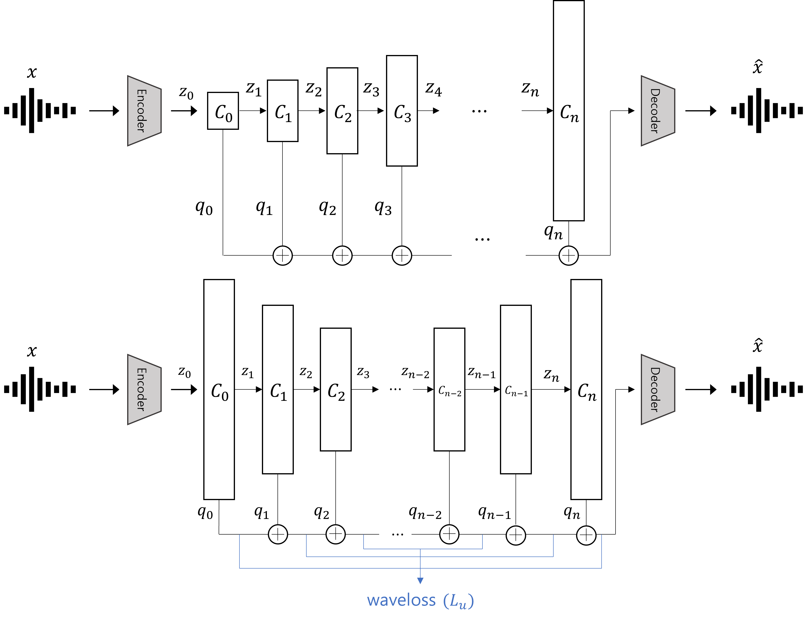

# WNAC: Wavescale Neural Audio Codec

<div align="center">

</div>
<p align="center" style="font-size: larger;">
  <a href="">Wavescale Neural Audio Codec: Bidirectional Multiscale Residual Quantization for High-Fidelity Audio Compression</a>
</p>

<p align="center">

<p>

<br>

# Installation

- Install all packages via ```pip3 install -r requirements.txt```.


# Dataset

```
datasets
├── audioset
├── common_voice
├── daps
├── datasets_fullband
├── jamendo
├── musdb
└── vctk

```

---

## Training

```
torchrun --standalone --master_addr=0.0.0.0 --nproc_per_node=3 -m scripts.train --args.load conf/wavescale_16.yml --save_path runs/wavescale_16
```

## Inferencing

Sampling test dataset:
```
python -m scripts.save_test_set --sample_rate 44100 --output samples/general --args.load conf/base.yml
```

Encoding test:
```
python -m wnac encode samples/general \
    --output results/encode/wavescale_15/general \
    --weights_path checkpoints/wavescale_15/weights.pth \
    --win_duration 10 \
    --plot_path plot/wavescale_15/general \
    --sample_rate 44100
```

Decoding test:
```
python -m wnac decode results/encode/wavescale_15/general \
    --output results/decode/wavescale_15/general \
    --weights_path checkpoints/wavescale_15/weights.pth
```

## Evaluating

```
python -m scripts.eval \
    --input samples/general \
    --output results/decode/wavescale_15/general \
    --n_proc 1 \
```

## Evaluation Results

| Model     | Mel ↓  | STFT ↓ | L1 ↓   | SI-SDR ↑ | FAD ↓  |
|-----------|--------|--------|--------|----------|--------|
| wavescale_15 | **0.772** | **1.777** | **0.030** | **5.599**  | **0.911** |
| wavescale_31 | **0.637** | **1.630** | **0.023** | **8.635**  | **0.503** |


## Acknowledgements

Module definitions are adapted from the [Descript Audio Codec](https://github.com/descriptinc/descript-audio-codec).
